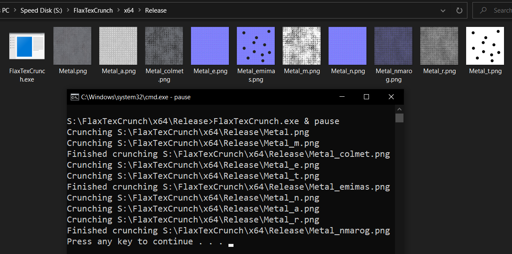
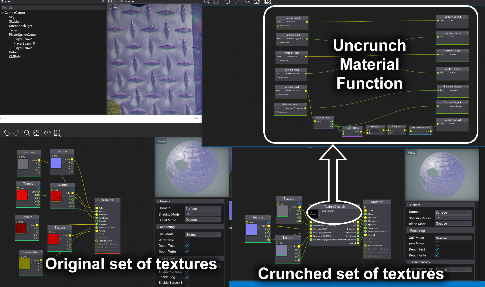

# Archived since I no longer help develop/use Flax engine.

# FlaxTexCrunch
This application allows you to combine multiple textures into one for the use with Unary's custom `TextureUncrunch` material node.

### Example of the tool crunching textures:

### Example of the resulting textures being used in the engine:

