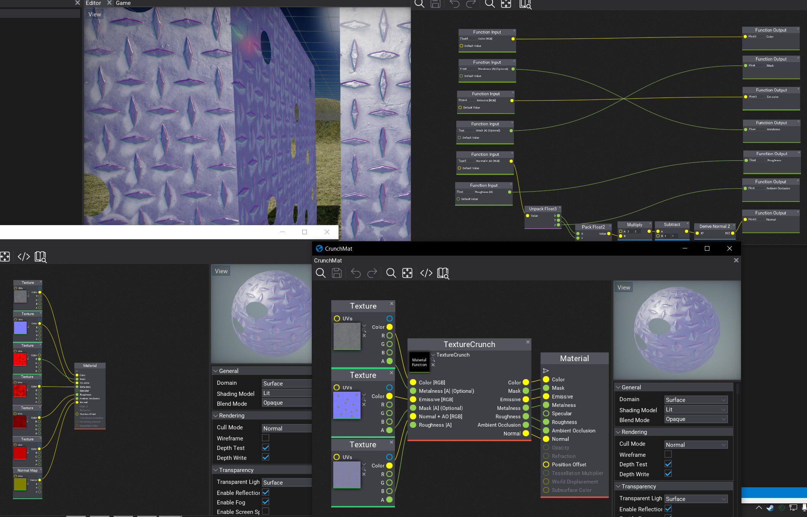

# FlaxTexCrunch
This application allows you to combine multiple textures into one for the use with Flax Engine's custom `Texture Crunch` material node.

### Example of the tool crunching textures:

### Example of the resulting textures being used in the engine:

